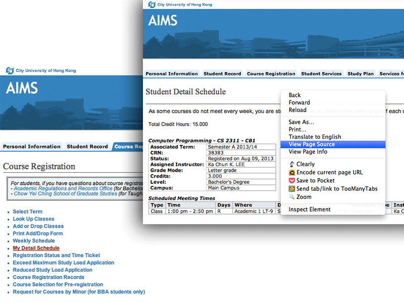
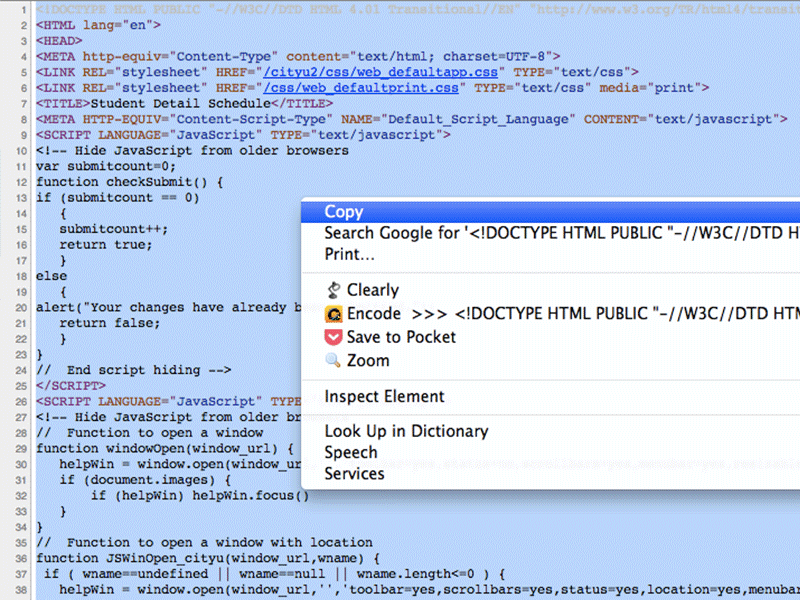
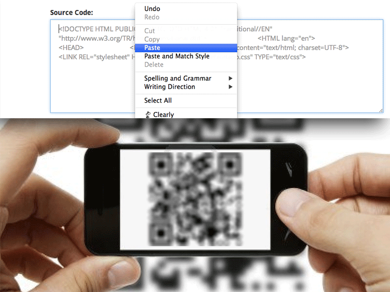

<label>A web tool generating calendar files which can be read by most calandar apps among the world from your CityU schedule.</label>
			

				

					In CityU, everybody (almost) has a schedule, 
					listing when and where our classes are going to be. 
					Normally, a <strong>screenshot</strong> of "Weekly Schedule" is taken and stored in our phones or even set as wallpaper, 
					<strong>However</strong>, troubles come:
				

				<blockquote>
					"Why the ugly timetable should occupy my desktop!"
				</blockquote>
				<blockquote>
					"Why the schedule doesn't tell me whether <strong>this week</strong> I need to take this course or not!"
				</blockquote>
				<blockquote>
					"Come on!!! I need someone to remind me before the class!!!"
				</blockquote>
				

					So here is <strong>TimeSheettyU<small>beta</small></strong>, making schedule into your Calendar App, remind setting, weekly detecting, extendable, and simplifying your timetable!
				

			

		

		

			<iframe style="width: 100%; height: 300px;" src="//www.youtube.com/embed/xWTv19ozzOk" frameborder="0" allowfullscreen></iframe>
		

	

	

		

			<h3>1. Open the "My Detail Schedule" in AIMS and see the source code;</h3>
		

		

			<h3>2. Copy the page's source code into the text box below;</h3>
		

		

			<h3>3. Use your phone to scan the QR Code to download the calendar file and ENJOY!</h3>
		

	

	

		

			
		

		

			
		

		

			
		

	

	

		

			 
			

				<em>You'd better use a new calendar to store the schedule (making the choice while opening the schedule file), in case your schedule is changing and if so you can simply remove the whole calendar then create a new one.</em>
			

		

	
